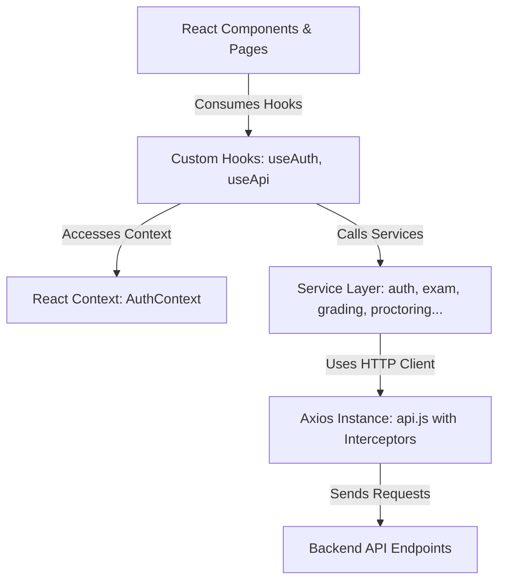

# 🎓 CBT Portal (U-Exam) - Computer-Based Test with Edge AI Proctoring

[](https://react.dev/)
[](https://vite.dev/)
[](https://tailwindcss.com/)
[](#🏛️-clean-architecture--project-structure)
[](#-scripts)

CBT Portal (U-Exam) adalah platform **Computer-Based Test (CBT)** modern, aman, dan scalable yang dirancang untuk kebutuhan akademis. Platform ini mengintegrasikan **Learning Management System (LMS)** dan sistem ujian online yang dilengkapi dengan **Edge-based AI Proctoring** untuk mendeteksi tindakan kecurangan secara real-time langsung dari web browser peserta.

Aplikasi ini telah direfaktor sepenuhnya menggunakan **Clean Architecture** guna memisahkan logika bisnis (business logic) dengan tampilan UI (presentation layer), menjadikannya sangat mudah dikembangkan (scalable) dan dirawat (maintainable).

---

## 🏛️ Clean Architecture & Project Structure

Projek ini menerapkan **Clean Architecture** yang terbagi menjadi lapisan-lapisan terpisah. Dengan arsitektur ini, komponen UI tidak melakukan request HTTP atau manipulasi storage secara langsung, melainkan melalui service layer dan custom hooks.

### Diagram Arsitektur & Aliran Data



### Struktur Direktori

Berikut adalah struktur folder hasil refaktorisasi Clean Architecture:

```
src/
├── config/             # Konfigurasi aplikasi (API base URL, dll)
├── context/            # React Context untuk global state management
│   └── AuthContext.jsx # Mengelola session, login, logout, dan status user
├── hooks/              # Custom React Hooks reusable
│   ├── useAuth.js      # Hook untuk mengakses AuthContext secara instan
│   └── useApi.js       # Hook generic untuk mengelola loading, data, & error state API
├── services/           # Service Layer - Komunikasi HTTP API (Axios)
│   ├── api.js          # Central Axios client dengan request/response interceptors
│   ├── auth.service.js # Authentication API requests
│   ├── exam.service.js # Ujian, bank soal, dan manajemen token
│   ├── grading.service.js # Evaluasi dan rekapitulasi nilai mahasiswa
│   ├── materi.service.js  # Manajemen bahan ajar (LMS)
│   ├── matkul.service.js  # Master data mata kuliah (Admin)
│   └── proctoring.service.js # Laporan pelanggaran AI Proctoring
├── utils/              # Pure utility functions / helpers
│   ├── auth.utils.js   # Normalisasi role & permissions
│   └── format.utils.js # Formatter waktu dan tanggal
├── components/         # Reusable presentation components & guards
│   ├── RouteGuards.jsx # RequireAuth & RequireRole guards
│   └── DashboardLayout.jsx # Layout dashboard responsif
├── pages/              # Halaman Tampilan (UI Views)
│   ├── Login.jsx / Register.jsx / profile.jsx
│   ├── AdminDashboard.jsx
│   ├── DashboardOverview.jsx (Dashboard Dosen)
│   ├── CreateExam.jsx / ManageQuestions.jsx
│   ├── Grading.jsx / RekapNilai.jsx
│   ├── AiProctoring.jsx (Monitor Log Kamera CCTV Ujian)
│   ├── StudentDashboard.jsx / TakeExam.jsx (Ujian + Face Detection)
│   └── StudentMateri.jsx / ManageMateri.jsx (LMS Pustaka)
├── App.jsx             # Router Utama & Provider Setup
└── main.jsx            # Entry Point Aplikasi
```

---

## ⚡ Fitur Utama

1. **Edge AI Proctoring (face-api.js)**:
   - Pendeteksian wajah real-time langsung di browser menggunakan model **TinyFaceDetector**.
   - Hemat bandwidth karena video tidak dikirim ke server. Web hanya mendeteksi pelanggaran (`WAJAH_TIDAK_TERDETEKSI` atau `WAJAH_LEBIH_DARI_SATU`).
   - Secara otomatis mengambil screenshot wajah pelanggar dan mengirimkannya ke database dosen dengan sistem cooldown 15 detik untuk menghindari overload API.
2. **Centralized Authentication & Role Guard**:
   - Role-based routing untuk tiga tingkat aktor: **Admin**, **Dosen**, dan **Mahasiswa**.
   - Interceptor token JWT otomatis menyisipkan header `Authorization` ke setiap request HTTP dan melakukan force logout otomatis jika token kedaluwarsa (401 Unauthorized).
3. **Flexible LMS (Pustaka Materi)**:
   - Dosen dapat mengunggah file materi kuliah (PDF, PPT, Word) dan mahasiswa dapat melihat serta mengunduhnya langsung melalui dashboard.
4. **Dynamic Grading & AI Evaluation**:
   - Penilaian otomatis untuk pilihan ganda tunggal dan pilihan ganda majemuk.
   - Panel evaluasi essay dibantu AI serta fitur override/penilaian manual oleh dosen untuk menjamin akurasi.
5. **Dynamic Excel Report Exports**:
   - Rekap nilai mahasiswa per ujian atau per mata kuliah dapat diekspor langsung ke file `.xlsx` menggunakan dynamic parsing Excel (SheetJS).

---

## 🛠️ Tech Stack & Dependencies

- **Frontend Framework**: React 19 & Vite 7 (dilengkapi dengan code-splitting untuk loading optimal).
- **Styling & UI UX**: Tailwind CSS 4 & Framer Motion untuk transisi halus serta micro-interactions premium.
- **State Management**: React Context (Global Auth State).
- **HTTP Client**: Axios (dengan Interceptor global).
- **Libraries**:
  - `face-api.js` untuk face tracking AI.
  - `xlsx` (SheetJS) untuk ekspor rekapitulasi nilai.
  - `sweetalert2` untuk notifikasi dialog interaktif yang elegan.

---

## 🚀 Memulai (Getting Started)

### Prasyarat

- Node.js versi `20.x` atau lebih baru.
- npm atau yarn.

### Langkah Instalasi

1. **Clone repositori**:
   ```bash
   git clone https://github.com/username/cbt-frontend.git
   cd cbt-frontend
   ```

2. **Install dependensi**:
   ```bash
   npm install
   ```

3. **Konfigurasi Environment**:
   Buat file `.env` di root directory:
   ```env
   VITE_API_BASE_URL=http://localhost:5000/api
   ```

4. **Jalankan aplikasi di mode Development**:
   ```bash
   npm run dev
   ```

5. **Build untuk Produksi**:
   ```bash
   npm run build
   ```

---

## 📜 Scripts

Di dalam `package.json`, Anda dapat menggunakan perintah berikut:

- `npm run dev`: Menjalankan server lokal pengembangan (Vite).
- `npm run build`: Mem-compile proyek ke direktori `dist/` untuk deploy ke hosting.
- `npm run lint`: Memeriksa kualitas kode JavaScript/React menggunakan ESLint (bebas error).
- `npm run preview`: Menjalankan preview lokal hasil compile produksi.
